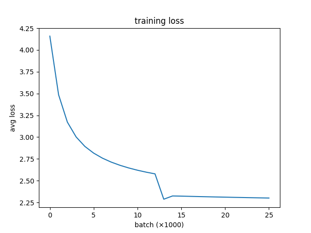
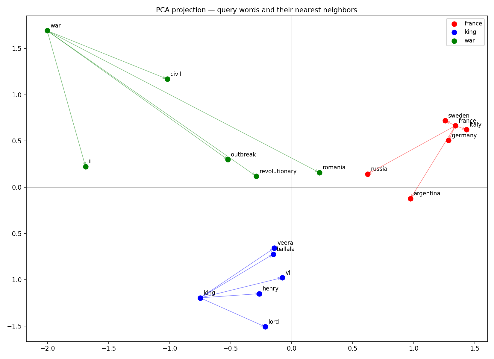

# word2vec-numpy
Word2Vec skip-gram with negative sampling, implemented from scratch in pure NumPy. 
Built as a JetBrains internship application task.

## What's implemented

- Tokenization and vocabulary building with min-frequency filtering
- Skip-gram pair generation with sliding window
- Negative sampling with unigram distribution smoothed by frequency^0.75
- Batched forward pass with manual gradient derivation
- Numerically stable sigmoid and log-sigmoid
- SGD updates via `np.add.at` for correct repeated-index accumulation
- Gradient correctness verified with finite-difference tests
- Cosine similarity and most-similar word evaluation

## Results

Trained on WikiText-2 (~1.6M tokens, vocab ~19k words), 2 epochs. Loss mostly plateaued after epoch 2, additional epochs showed diminishing returns without learning rate decay.



Some nearest neighbors after training:
```
most_similar("france")              → italy (0.900), germany (0.883), russia (0.839)
most_similar("king")                → henry (0.784), veera (0.781), lord (0.778)
most_similar("war")                 → civil (0.729), ii (0.687), romania (0.6757)
cosine_similarity("king", "queen")  → 0.719
```

PCA projection of query words and their nearest neighbors each color is one query group:



## Usage
```bash
git clone https://github.com/NotAIModel/word2vec-numpy
cd word2vec-numpy
pip install -r requirements.txt
pytest
```

Train from scratch:
```bash
python train.py
```

Pretrained artifacts are also included in `artifacts/`, so you can inspect the learned embeddings without retraining.

Run demo (prints nearest neighbors and saves PCA visualization to `artifacts/`):
```bash
python demo.py
```
## Design notes

- **Gradient scaling**: loss is reported as batch mean for readability, but 
  `backward()` computes summed gradients (no `/B` division). This is a deliberate 
  choice. Dividing gradients by B would require scaling LR up by B to compensate:

  | reduction | formula | equivalent LR |
  |-----------|---------|---------------|
  | sum | `step = lr * B * mean_grad` | `lr = 0.025` |
  | mean | `step = lr * mean_grad` | `lr = 0.025 * B = 12.8` |

  Both are mathematically equivalent for constant-LR SGD. I prefer summed 
  gradients + `lr=0.025` since 0.025 is the value from the original paper and 
  avoids an unintuitive large LR in the config. Note: this coupling means 
  changing `BATCH_SIZE` requires adjusting `LR` proportionally.

- **Two embedding matrices**: `weights_cntr` (center) and `weights_ctx` (context),
  both shape `(V, D)`. Final embeddings use `weights_cntr` following the original 
  paper, averaging both matrices is also a valid alternative.
- **Embedding dim = 100**: original paper used 300 on a much larger corpus.
  100 is sufficient for WikiText-2.
- **Tokenizer**: lowercase letters only (`[a-z]+`). Simple and sufficient for 
  WikiText-2, though it drops punctuation and numbers.

## Possible improvements

- Frequent-word subsampling
- Streaming training-pair generation instead of precomputing all pairs
- Quantitative evaluation on analogy/similarity benchmarks
- Learning-rate scheduling